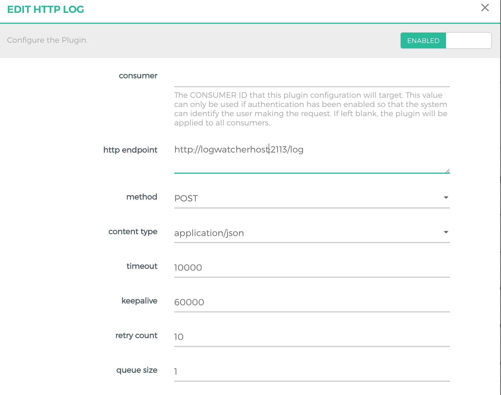
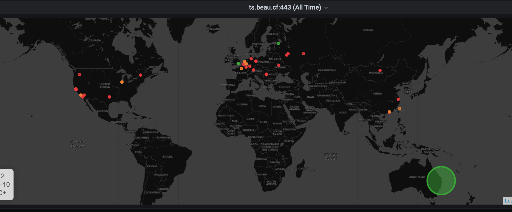
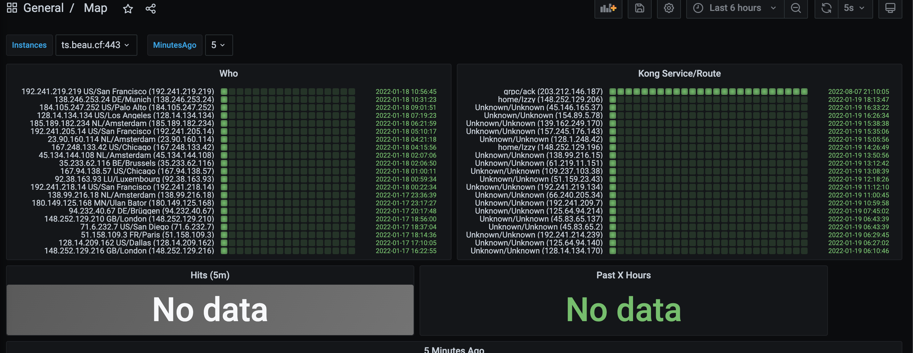

# KONG-LOG-STREAM

## Purpose
Combining https://grafana.com/grafana/plugins/grafana-worldmap-panel/
with https://ipinfo.io to create a map of all client_ips hitting the kong instance

## Installation
Copy binary to /opt/logwatcher/logwatcher

### Flags
```go
apiPort   = flag.String("apiPort", "2113", "Port for API Server")
cacheFile = flag.String("cache", "./database/cache.json", "Cache JSON File Location for IP DATA")
apiOnly   = flag.Bool("apiOnly", false, "Do not attempt to open a log file, just listen to api")
logFile   = flag.String("log", "./log/all.log", "Log File Path")
database  = flag.String("db", "", "DB File Path")
````
### Systemd service
```
[Unit]
Description=KongLogWatcher

[Service]
Restart=on-failure
RestartSec=5s

TimeoutStartSec=0
ExecStart=/opt/logwatcher/logwatcher --cache /opt/logwatcher/db/cache.json --db /opt/logwatcher/db/all.log --apiOnly true

[Install]
WantedBy=multi-user.target
```

### KONG Plugin (HTTP LOG)
`http endpoint` to http://`logwatcher_host`:`2113`




## Metrics Exposed
on port `2113/metrics

The following metrics will be exported:
```prometheus
kong_client{geohash="ucftpvqu5527",place="RU/Moscow (109.248.6.17)",route="Unknown",service="Unknown",target="109.248.6.17"} 1
kong_client_lastseen{geohash="ucftpvqu5527",place="RU/Moscow (109.248.6.17)",route="Unknown",service="Unknown",target="109.248.6.17"} 1.642555685e+09
```


## Grafana Dashboard
Theres a dashboard output located [here](grafana).

You'll need to change `job` to match your prometheus job on `line 453`
```json
        "definition": "kong_client{job=\"nas\"}",
```
### Example World Map


### Example Table 
